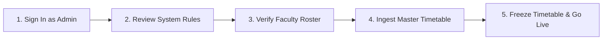
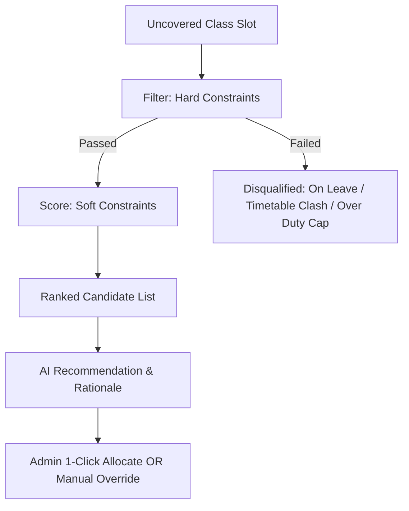

# 🏛️ Apollo University — Faculty Duty Allocation & Substitution System
## 📖 Comprehensive Administrator Operations Manual & User Guide

---

## 📌 Executive Summary

The **Faculty Duty Allocation & Substitution System** is an enterprise-grade academic operations platform designed for university administration, deans, heads of departments (HOD), and program coordinators.

It replaces manual, error-prone spreadsheets with an **algorithmic constraint engine** and **AI reasoning** to manage:
1. **Daily Lecture Substitutions** (conflict-free, fair-workload distribution).
2. **Master Timetable Ingestion & Version Control** (supporting multi-year & 6 engineering departments).
3. **Exam Invigilation Duty Allocation** (hall assignments & workload caps).
4. **Faculty Profiles & Subject Specialization Tracking**.
5. **Institutional Audit Trails & Real-Time Alerts**.

---

## 🔐 1. Access & Initial Login

### 1.1 Default Administrator Credentials
When the system is started for the first time with seeded data, use the default administrator account:

| Attribute | Default Value | Notes |
| :--- | :--- | :--- |
| **Portal URL** | `http://localhost:3000` (Local) / Production URL | Access via any modern web browser |
| **Email / Username** | `admin@apollouniversity.edu.in` | Primary institutional admin account |
| **Default Password** | `Apollo@2026` | ⚠️ *Must be changed upon initial setup* |
| **Assigned Role** | `ADMIN` | Unrestricted full system access |

### 1.2 User Roles & Permission Hierarchy

| Role Code | Role Name | Key Capabilities |
| :--- | :--- | :--- |
| **`ADMIN`** | System Administrator | Full access: User management, timetable upload/freeze, system rules, manual duty override, database logs, and all department data. |
| **`DEAN`** | Academic Dean | Institutional oversight: View cross-department duty statistics, approval logs, workload analytics, and academic calendars. |
| **`PC` / `HOD`** | Program Coordinator / HOD | Departmental control: Manage department faculty, review absence requests, view departmental substitution rosters. |
| **`FACULTY`** | Teaching Faculty | Personal portal: View assigned classes, report leave/absence, view assigned substitution/exam duties, receive alerts. |
| **`INTERNAL_MEMBERS`** | Internal Committee / Staff | View access to scheduled exam duty rosters and general notices. |
| **`ADDITIONAL_MEMBERS`** | Auxiliary Staff | Limited auxiliary duty tracking and notifications. |

---

## 🚀 2. Quickstart: 5-Step Administrator Onboarding

Follow these 5 steps to get the system operational for a new semester in under 15 minutes:



### Step 1: Sign In & Change Default Password
1. Navigate to the Login Page (`/login`).
2. Sign in with `admin@apollouniversity.edu.in` / `Apollo@2026`.
3. Open **User Management** (`/users`) to update the admin profile or set a secure custom password.

### Step 2: Configure System Rules (`/system-rules`)
1. Click **System Rules** on the admin sidebar.
2. Confirm or customize institutional constraints:
   - **Max Weekly Substitutions per Faculty** (Default: `4`).
   - **Max Daily Regular Classes per Faculty** (Default: `2`).
   - **Institution Name** (`The Apollo University`).
   - **Institutional Timezone** (`Asia/Kolkata`).
3. Click **Save Configuration**.

### Step 3: Verify Faculty Roster & Specializations (`/faculty`)
1. Open the **Faculty Management** tab.
2. Ensure faculty members are assigned to their approved department:
   - `AIDS` — Artificial Intelligence & Data Science
   - `AIML` — AI & Machine Learning
   - `CSE` — Computer Science & Engineering
   - `CS` — Cyber Security
   - `CC` — Cloud Computing
   - `AIHC` — AI in Healthcare
3. Verify their **Subject Expertise** tags and **Exemption Status** (e.g., medical leave or administrative duties).

### Step 4: Import Master Semester Timetable (`/timetables`)
1. Click **Timetable Management**.
2. Click **Import Timetable (CSV / Excel)**.
3. Select your institutional timetable file (`.csv` or `.xlsx`). The parser supports multi-sheet workbooks and automatically maps slots by department, year (1st to 4th Year), day, time slot, subject code, and faculty email.
4. Click **Preview & Ingest**.

### Step 5: Freeze Active Timetable Version
1. Once uploaded, review the timetable version.
2. Click **Freeze Timetable Version**.
3. *Why freeze?* Freezing locks the active timetable so the substitution engine can accurately compute conflict-free slots.

---

## 📋 3. Step-by-Step Module Operations

---

### 3.1 📊 Admin Dashboard (`/admin`)
The command center displays high-level real-time operational metrics:
- **Total Faculty Count**: Active faculty across all 6 departments.
- **Active Substitutions Today**: Real-time count of substitution duties assigned for the current date.
- **Absent Today**: Number of faculty members on approved leave today.
- **Pending Actions**: Absences that require substitute allocation.
- **System Health & DB Status**: Neon PostgreSQL connection health check.

---

### 3.2 👥 Faculty & User Management (`/faculty` and `/users`)

#### Adding a New Faculty Member:
1. Go to **Faculty Management** -> Click **+ Add Faculty**.
2. Fill in the profile details:
   - **Full Name**: e.g., `Dr. Sarah Jenkins`
   - **Institutional Email**: e.g., `s.jenkins@apollouniversity.edu.in`
   - **Department**: Choose from `AIDS`, `AIML`, `CSE`, `CS`, `CC`, or `AIHC`.
   - **Designation**: Professor / Associate Professor / Assistant Professor.
   - **Subject Expertise**: Select subjects the faculty can teach (e.g., `CS301 - Data Structures`, `AI204 - Machine Learning`).
   - **Max Weekly Duty Limit**: Default `4` (or lower for HODs/Deans).
   - **Exemption Flag**: Check if exempt from substitution or exam duties (e.g., pregnancy, medical, research sabbatical).
3. Click **Save Faculty**.

#### User Account Creation & Role Assignment:
1. Navigate to **User Management** (`/users`).
2. Click **+ Add User Account**.
3. Enter email, name, role (`ADMIN`, `DEAN`, `PC`, `FACULTY`), and temporary password.
4. If the user is a faculty member, link the user account to their faculty profile ID.

---

### 3.3 📅 Timetable Operations & Ingestion (`/timetables`)

#### Timetable CSV/Excel Format Requirements:
The timetable importer accepts standard CSV or Excel files with the following columns:

```csv
Day,StartTime,EndTime,RoomNumber,SubjectCode,SubjectName,DepartmentCode,AcademicYear,SectionName,FacultyEmail
Monday,09:00,10:00,LH-101,CS201,Data Structures,CSE,2,A,faculty1@apollouniversity.edu.in
Monday,10:00,11:00,LH-203,AI302,Neural Networks,AIML,3,B,faculty2@apollouniversity.edu.in
```

#### Viewing & Filtering Timetables:
- **Filter by Academic Year**: View 1st, 2nd, 3rd, or 4th Year classes.
- **Filter by Department**: Isolate schedules for `AIDS`, `AIML`, `CSE`, etc.
- **Filter by Faculty**: Check a specific professor's weekly teaching load.

---

### 3.4 🏖️ Absence & Leave Processing (`/absences`)

When a faculty member applies for leave (or when admin enters an emergency absence on their behalf):

1. Go to **Absences & Leaves** -> Click **+ Record Absence**.
2. Select:
   - **Faculty Member**: e.g., `Prof. Rajesh Kumar`
   - **Date Range**: Start Date and End Date.
   - **Absence Type**: Sick Leave, Casual Leave, Duty Leave, Emergency.
   - **Reason**: Brief justification.
3. Click **Submit & Generate Requirements**.
4. **Automated Action**: The system immediately scans the active timetable for all classes taught by this faculty member during the leave period and creates **Substitution Requirements** ready for allocation.

---

### 3.5 🤖 Substitution Allocation Engine (`/substitutions`)

The allocation engine pairs algorithmic fairness with AI reasoning to select the best substitute teacher.

#### How Candidate Ranking Works:



#### 1. Hard Constraints (Mandatory Elimination Criteria):
A faculty member is **strictly disqualified** if:
* ❌ They are on approved leave on that date.
* ❌ They already have a regular timetable lecture at that exact day and time slot.
* ❌ They have reached their maximum weekly substitution cap (e.g., 4 duties/week).
* ❌ They already have an assigned substitute duty or exam duty at that hour.
* ❌ They are marked with an active **Duty Exemption**.

#### 2. Soft Scoring Formula (Weights & Ranking):
Qualified candidates receive a composite score from **0 to 100 points**:

| Scoring Criterion | Points | Rationale |
| :--- | :--- | :--- |
| **Subject Expertise Match** | **+40 pts** | Highest priority: Faculty is certified to teach this specific course. |
| **Department Match** | **+30 pts** | Faculty belongs to the same academic department (`CSE` for `CSE`). |
| **Fair Workload Balance** | **+20 pts** | Faculty with fewer substitutions this week get priority. |
| **Schedule Spacing** | **+10 pts** | Avoids consecutive lecture fatigue (gap between classes). |

#### 3. Allocating Duties:
- **1-Click Batch Auto-Allocate**: Automatically assigns the #1 ranked candidate to all pending requirements for the day.
- **Manual Assignment & AI Review**: Click on any requirement to inspect candidate rankings, view the **NVIDIA Nemotron AI Reasoning explanation**, and pick a preferred substitute.
- **Notify Faculty**: Once allocated, automated in-app notifications are dispatched to both the absent faculty and the assigned substitute.

---

### 3.6 📝 Exam Duty Allocation (`/exam-duties`)

Manage end-semester and mid-term invigilation duties:
1. Open **Exam Duties**.
2. Click **+ Create Exam Session**:
   - Date, Session (Morning: 09:30 - 12:30 / Afternoon: 01:30 - 04:30).
   - Exam Name (e.g., `B.Tech Sem-IV Midterm Examinations`).
   - Hall Numbers (e.g., `LH-101, LH-102, Aud-1`).
   - Required Invigilators per Hall (e.g., `2 Invigilators + 1 Reliever`).
3. Click **Auto-Allocate Exam Duties**:
   - The engine balances duty distribution so that no faculty member is overloaded with multiple consecutive exam slots while others have none.
4. Click **Export Invigilation Duty Chart (PDF/CSV)** for physical noticeboard posting and signing.

---

### 3.7 📜 Audit Logs & Compliance (`/audit-logs`)

Every critical administrative action is stored in an immutable audit ledger:
- **Timestamp** (with institutional timezone).
- **User / Admin Email**.
- **Action Type**: `TIMETABLE_FREEZE`, `DUTY_ALLOCATED`, `MANUAL_OVERRIDE`, `FACULTY_EXEMPTION_TOGGLED`, `RULE_MODIFIED`.
- **Target Entity & Details**: Exact payload of before/after state.

---

### 3.8 📈 Analytics & Reports (`/reports`)

Export compliance and administrative reports:
1. **Weekly Substitution Balance Sheet**: View total substitution hours served by each professor across all departments.
2. **Faculty Workload Variance Report**: Identify overloaded vs. under-utilized faculty.
3. **Departmental Leave & Coverage Statistics**: Track absence patterns and substitute coverage rates.

---

## 🛠️ 4. Administrator Troubleshooting & FAQs

### Q1: "The auto-allocation engine returns 'No candidates available' for a class slot."
* **Cause**: All faculty members in the department either have regular classes at that hour, are on leave, or have reached their weekly duty cap.
* **Solution**:
  1. Open **Faculty Management** and check if nearby allied departments (e.g., `AIML` for `AIDS`, or `CS` for `CSE`) have available faculty.
  2. Temporarily adjust the **Max Weekly Substitutions** under **System Rules** if there is an institutional emergency.
  3. Check if any faculty member has a temporary duty exemption that can be cleared.

### Q2: "How do I update the timetable midway through a semester?"
* **Solution**:
  1. Open **Timetable Management**.
  2. Click **Unfreeze Current Version**.
  3. Upload the revised CSV / Excel file or edit individual slots.
  4. Click **Freeze Timetable Version** to reactivate the substitution engine.

### Q3: "How do I secure the database credentials?"
* **Solution**:
  1. Never commit `.env` files containing live credentials to Git.
  2. Ensure your `.env` file uses a strong `SECRET_KEY` for JWT token hashing.
  3. For Neon PostgreSQL, rotate connection passwords periodically from your [Neon Console](https://console.neon.tech).

---

## 📞 5. System Administration Support Checklist

| Schedule | Task | Verification |
| :--- | :--- | :--- |
| **Daily (08:00 AM)** | Check `/absences` for morning leave notices | Run Auto-Allocator & dispatch alerts |
| **Weekly (Friday 05:00 PM)** | Check `/reports` for weekly duty fairness | Reset or review weekly substitution counters |
| **Monthly** | Review `/audit-logs` for compliance | Check for unauthorized overrides |
| **Semester Start** | Upload new master timetables to `/timetables` | Freeze active version before classes begin |

---

*© 2026 The Apollo University — Faculty Duty Allocation & Substitution System*
