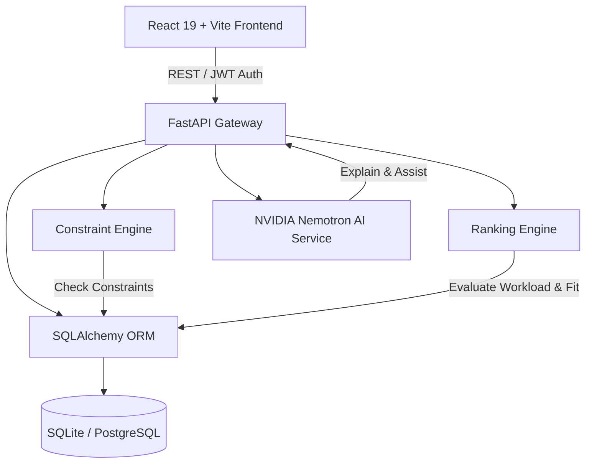

# 🎓 Intelligent Faculty Substitution & Timetable Allocation System

<div align="center">

[](https://www.python.org/)
[](https://fastapi.tiangolo.com/)
[](https://react.dev/)
[](https://www.typescriptlang.org/)
[](https://vitejs.dev/)
[](https://tailwindcss.com/)
[](https://build.nvidia.com/)
[](https://vercel.com/)
[](https://www.postgresql.org/)
[](LICENSE)
[](https://github.com/fareedahamed0425-code/faculty-duty-allocation-system/pulls)

<br/>

**An AI-powered, constraint-aware, multi-tiered institutional scheduling and faculty duty substitution management platform designed for universities and academic institutions.**

[Live Demo](#-one-click-deployment) • [Key Features](#-core-capabilities) • [Architecture](#-system-architecture) • [Getting Started](#-getting-started) • [Deployment](#-vercel--cloud-deployment)

</div>

---

## 🌟 Overview

The **Intelligent Faculty Substitution & Timetable Allocation System** eliminates chaotic academic rescheduling caused by unexpected faculty leaves, academic events, and departmental workload imbalances. 

Powered by a **deterministic Constraint-Satisfaction Engine** combined with **NVIDIA Nemotron AI Reasoning**, the system automatically matches unallocated lectures and labs to eligible, available, and workload-balanced substitute professors in real time while respecting strict institutional policies.

---

## 🚀 Core Capabilities

### 🧠 1. Dual Allocation Engine (Deterministic + AI Reasoning)
* **Zero Hard-Constraint Violations**: Enforces slot availability, department affinity, weekly substitution caps, and daily teaching limits.
* **Weighted Multi-Factor Ranking**: Ranks candidates based on subject specialization, recent substitute load, consecutive class fatigue, and seniority.
* **NVIDIA Nemotron-3 Reasoning**: Generates transparent, human-readable explanations for every substitution decision and powers natural-language schedule queries.

### 🏛️ 2. Multi-Role Institutional Portals
* **👑 Dean / Provost**: Institution-wide cross-departmental analytics, leave impact reports, and global override controls.
* **👔 Head of Department (HOD)**: Departmental timetables, automated leave approvals, candidate suggestions, and manual override workflows.
* **👨‍🏫 Faculty Member**: Personal timetable schedules, upcoming substitute duty notifications, leave request filings, and historical duty logs.
* **⚙️ System Admin**: Full timetable CSV/Excel wizard imports, active semester management, audit trail inspections, and institutional rule configuration.

### 📊 3. Timetable Grid & Smart Import Wizard
* Interactive weekly timetable matrix with visual clash detection, room occupancy tracking, and multi-filter navigation.
* Drag-and-drop or CSV batch upload wizard that validates faculty IDs, subject codes, batch/room allocations, and detects scheduling conflicts before ingestion.

### 🔔 4. Real-Time Alerting & Audit Logging
* In-app notification center with instant alerts when duties are assigned, swapped, or approved.
* Immutable audit trails documenting every automated substitution, manual override, and administrative override with timestamps and actor IDs.

---

## 🏗️ System Architecture



```
faculty-duty-allocation-system/
├── api/
│   └── index.py               # Vercel Serverless Python Adapter
├── backend/
│   ├── app/
│   │   ├── ai/                # NVIDIA Nemotron client & natural language tools
│   │   ├── allocation/        # Hard & Soft constraint evaluation + ranking engine
│   │   ├── api/v1/            # Modular FastAPI endpoints (auth, duties, timetable, etc.)
│   │   ├── core/              # Config, institutional rule defaults, JWT security
│   │   ├── db/                # SQLAlchemy database session & Base model
│   │   ├── models/            # Relational database schemas (Faculty, Duty, Timetable)
│   │   ├── schemas/           # Pydantic validation schemas
│   │   ├── seed/              # Institutional seed data with demo users
│   │   └── services/          # Business logic (Absence, Notification, Report, Timetable)
│   └── requirements.txt       # Backend Python dependencies
├── frontend/
│   ├── public/                # Logos, SVGs, and static assets
│   ├── src/
│   │   ├── api/               # Typed Axios client with auto-JWT interceptors
│   │   ├── components/        # Reusable UI cards, modals, grids, drawers, wizard
│   │   ├── context/           # AuthContext & state management
│   │   ├── pages/             # Portal pages (Dean, HOD, Faculty, Admin, AI Assistant)
│   │   └── types/             # TypeScript domain models
│   ├── package.json           # Frontend dependencies (React 19, TailwindCSS, Lucide)
│   └── vite.config.ts         # Vite bundler configuration
├── .env.example               # Environment variables template
├── run_app.py                 # One-click local dual-server launcher
└── vercel.json                # Single-project Vercel Serverless configuration
```

---

## ⚙️ Institutional Constraint Matrix

The allocation engine evaluates candidate suitability through strict hierarchical filters:

| Category | Constraint | Rule Logic |
| :--- | :--- | :--- |
| **Hard Constraint** ⛔ | **Slot Availability** | Faculty cannot have an existing regular lecture, lab, or assigned substitution in the target timeslot. |
| **Hard Constraint** ⛔ | **Weekly Substitution Cap** | Faculty cannot exceed configured `MAX_WEEKLY_SUBSTITUTIONS` (Default: 4). |
| **Hard Constraint** ⛔ | **Active Leave Status** | Faculty who have approved leaves on the target date are strictly excluded. |
| **Soft Constraint** ⚖️ | **Department Affinity** | Prefers faculty belonging to the same department as the absent professor (+35 pts). |
| **Soft Constraint** ⚖️ | **Subject Competency** | Prioritizes professors tagged with matching subject expertise (+40 pts). |
| **Soft Constraint** ⚖️ | **Workload Equity** | Distributes duty to faculty with fewer cumulative substitutions (+25 pts). |
| **Soft Constraint** ⚖️ | **Fatigue Mitigation** | Penalizes assigning >2 consecutive back-to-back classes (-15 pts). |

---

## 🛠️ Tech Stack

<div align="center">

| Layer | Technologies Used |
| :--- | :--- |
| **Frontend UI** | React 19, TypeScript, Vite 8, Tailwind CSS 4, Lucide React, Date-fns, Axios |
| **Backend API** | Python 3.10+, FastAPI, Pydantic v2, Uvicorn, Starlette |
| **Database & ORM** | SQLAlchemy 2.0, SQLite (Local/Dev) / PostgreSQL (Production), Pandas |
| **AI & LLM** | NVIDIA Nemotron-3 (30B Omni Reasoning), NVIDIA Cloud API |
| **Authentication** | OAuth2 Password Bearer, JWT (JSON Web Tokens), Passlib (Bcrypt) |
| **Deployment** | Vercel Serverless Functions (`@vercel/python` + `@vercel/static-build`) |

</div>

---

## 💻 Getting Started

### Prerequisites
* **Python 3.10+**
* **Node.js 18+** & **npm**
* **Git**

### 1. Clone the Repository
```bash
git clone https://github.com/fareedahamed0425-code/faculty-duty-allocation-system.git
cd faculty-duty-allocation-system
```

### 2. Environment Configuration
Copy the sample environment file:
```bash
cp .env.example .env
```
*(Optional: Add your `NVIDIA_API_KEY` in `.env` to activate live AI reasoning).*

---

### 3. Launching Locally (Unified 1-Command Launcher)

Run the included launcher to automatically configure virtual environments, install dependencies, seed the database, and spin up both backend and frontend:

```bash
python run_app.py
```

Once running:
* **Frontend Portal**: `http://localhost:5173`
* **FastAPI Interactive Swagger Docs**: `http://localhost:8000/docs`
* **Health Check**: `http://localhost:8000/health`

---

### 4. Manual Setup (Alternative)

<details>
<summary><b>Click to expand manual setup instructions</b></summary>

#### Backend Setup:
```bash
cd backend
python -m venv .venv
# On Windows:
.venv\Scripts\activate
# On Linux/macOS:
source .venv/bin/activate

pip install -r requirements.txt
uvicorn app.main:app --host 0.0.0.0 --port 8000 --reload
```

#### Frontend Setup:
```bash
cd ../frontend
npm install
npm run dev
```

</details>

---

## 🔑 Demo Login Credentials

The system seeds with test accounts covering all institutional hierarchies:

| Role | Username / Email | Password | Access Level |
| :--- | :--- | :--- | :--- |
| **👑 Dean** | `dean@apollo.edu` | `dean123` | Cross-department analytics, institution overview, master rules |
| **👔 HOD (CSE)** | `hod_cse@apollo.edu` | `hod123` | CSE Department schedules, leaves, allocations, overrides |
| **👨‍🏫 Faculty (Dr. Sharma)** | `faculty1@apollo.edu` | `faculty123` | Personal timetable, substitution notices, leave applications |
| **👨‍🏫 Faculty (Prof. Rajesh)** | `faculty2@apollo.edu` | `faculty123` | Personal schedule, duty allocations |
| **⚙️ Admin** | `admin@apollo.edu` | `admin123` | Timetable wizard import, system rules, audit logs |

> 💡 *A quick 1-click Demo Role Switcher is also accessible directly from the top navigation bar during local development!*

---

## ☁️ Vercel & Cloud Deployment

This repository is pre-configured with [`vercel.json`](file:///d:/UNI%20project/vercel.json) to deploy as a **single, unified fullstack application** on Vercel:

1. Import this repository into [Vercel](https://vercel.com).
2. Set **Root Directory** to `./` (Default).
3. Add the following Environment Variables in the Vercel Dashboard:
   * `NVIDIA_API_KEY` = *(Your NVIDIA API key)*
   * `NVIDIA_MODEL` = `nvidia/nemotron-3-nano-omni-30b-a3b-reasoning`
   * `SECRET_KEY` = *(Your production secret string)*
   * `DATABASE_URL` = *(Optional: e.g., Neon or Supabase PostgreSQL connection string for permanent persistence)*
4. Click **Deploy** &mdash; Vercel builds the static React bundle and mounts FastAPI serverless functions on `/api/*` seamlessly!

---

## 🧪 Testing

Run backend constraint and allocation unit tests:
```bash
cd backend
pytest tests/
```

---

## 🤝 Contributing

Contributions, issues, and feature suggestions are always welcome!
1. Fork the Project
2. Create your Feature Branch (`git checkout -b feature/SmartLeavePrediction`)
3. Commit your Changes (`git commit -m 'Add Smart Leave Prediction'`)
4. Push to the Branch (`git push origin feature/SmartLeavePrediction`)
5. Open a Pull Request

---

## 📜 License

Distributed under the **MIT License**. See `LICENSE` for details.

<div align="center">
  <sub>Engineered with precision for modern higher education institutions.</sub>
</div>
